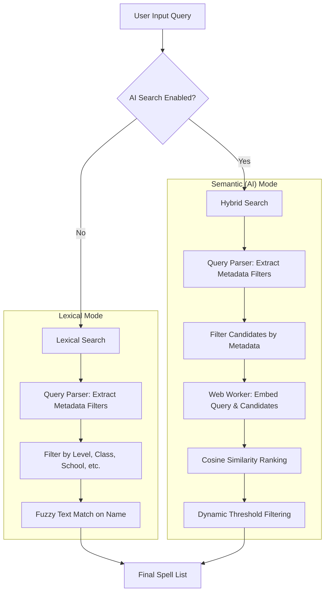

# Spelite - D&D 5e Spell Manager

Spelite est une application web légère et performante (PWA) conçue pour aider les lanceurs de sorts de Donjons & Dragons 5e à gérer leur grimoire, leurs sorts préparés et leurs emplacements de sorts, même hors-ligne.

## ✨ Fonctionnalités

- **Gestion multi-personnages** : Créez, sauvegardez et basculez entre plusieurs aventuriers.
- **PWA (Progressive Web App)** : Installez l'application sur votre mobile ou bureau et utilisez-la sans connexion internet.
- **Grimoire complet** : Recherchez et apprenez des sorts parmi une base de données multilingue (FR/EN).
- **Suivi des emplacements** : Gérez vos "slots" de sorts et effectuez des repos longs en un clic.
- **Backup & Restore** : Exportez vos personnages au format JSON pour les sauvegarder ou les transférer sur un autre appareil.

## 🛠️ Installation & Développement

### Prérequis

- Node.js (v20+)
- npm

### Installation

```bash
npm install
```

### Démarrage en local

```bash
npm run dev
```

### Build de production

```bash
npm run build
```

## 🚀 Déploiement particulier

L'application est configurée pour être déployée n'importe où (racine du domaine ou sous-répertoire).

### Déploiement en sous-répertoire

Si vous déployez l'application dans un dossier spécifique (ex: `https://mon-domaine.com/spelite/`), vous devez spécifier le chemin de base lors du build :

```bash
VITE_BASE_URL=/spelite/ npm run build
```

Si aucune variable n'est fournie, le build utilise des chemins relatifs (`./`), ce qui permet une portabilité maximale dans la plupart des environnements de "Proof of Concept".

## 📖 Guide Utilisateur

Bienvenue sur Spelite. Ce guide vous aidera à créer votre personnage et à gérer votre grimoire.

_Note : Une version détaillée est également disponible en anglais : [User Guide (EN)](docs/UserGuide.md)._

## 🏗️ Architecture & Search

Spelite uses a hybrid search architecture to provide fast, relevant results for D&D spells.

### General Architecture

- **Frontend**: Built with **Preact** and **Vite** for a lightweight footprint.
- **State Management**: Uses **Signals** for reactive, fine-grained state updates.
- **Styling**: **Tailwind CSS v4** with a "utility-first" yet minimalistic approach.
- **Data Layer**:
  - `ontologyRepository`: Efficient in-memory storage of spells and rules.
  - `IndexedDB (Dexie)`: Local persistence for characters and semantic embeddings.
- **Web Workers**: Heavy computations (AI models) are offloaded to a background thread.

### Search Flow



### 1. Lexical Mode (Default)
The query is processed by a rule-based parser (`queryParser.ts`) that identifies keywords (e.g., "level 3", "fire", "wizard") and converts them into structured filters. Any remaining text is used for a standard keyword search.

### 2. Semantic Mode (AI-Powered)
When enabled, Spelite uses **Transformers.js** to run a `paraphrase-multilingual-MiniLM-L12-v2` model directly in your browser.
- **Hybrid Approach**: Metadata filters are applied first to narrow down the search space.
- **Local AI**: Embeddings are computed and stored in your browser (IndexedDB). No data ever leaves your device.
- **Ranking**: Results are ranked by conceptual similarity rather than exact keyword matches (e.g., searching "healing" will find "Cure Wounds" even if the word "healing" isn't in the title).

### 1. Gestion des Personnages

Dans l'onglet **Personnage**, vous disposez de deux sections : **Éditer** et **Gérer**.

- **Créer** : Allez dans "Gérer" et cliquez sur "Créer un nouveau personnage".
- **Importer/Exporter** : Utilisez les boutons dédiés pour sauvegarder vos données dans un fichier JSON ou les restaurer.
- **Charger/Supprimer** : Basculez entre vos différents héros ou supprimez ceux dont vous n'avez plus besoin.

### 2. Configuration du Personnage

Une fois un personnage sélectionné, utilisez l'onglet **Éditer** pour renseigner :

- **Informations de base** : Nom, Classe, Race et Niveau.
- **Statistiques** : Vos scores de caractéristiques (Force, Dextérité, etc.). Les modificateurs et le DD de sauvegarde des sorts sont calculés automatiquement.
- **Combat** : Vos PV Max et votre CA de base.

**Important** : Cliquez sur le bouton **Sauvegarder le personnage** en bas de page pour appliquer vos modifications.

### 3. Gestion du Grimoire

Dans la vue **Grimoire**, vous pouvez :

- **Parcourir les sorts** : La liste est automatiquement filtrée selon votre classe et votre niveau.
- **Apprendre des sorts** : Cliquez sur "Apprendre" pour ajouter un sort à votre grimoire personnel.
- **Filtrer** : Utilisez la barre de recherche ou les filtres (niveau, école de magie) pour trouver rapidement un sort.

### 4. Utilisation du Tableau de Bord (Dashboard)

Le **Dashboard** est votre compagnon en combat :

- **Suivi des PV** : Mettez à jour vos points de vie actuels.
- **Emplacements de sorts** : Cliquez sur les emplacements pour suivre votre consommation de magie.
- **Détails des sorts** : Cliquez sur un sort appris pour voir sa description complète, sa portée et ses composants.

---

_Développé avec Preact, Signals, Vite et Tailwind CSS v4._
