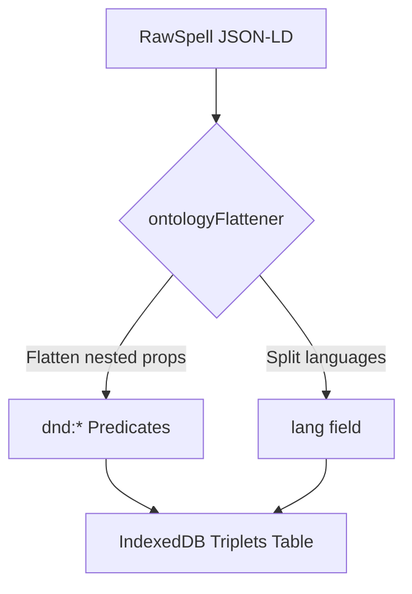
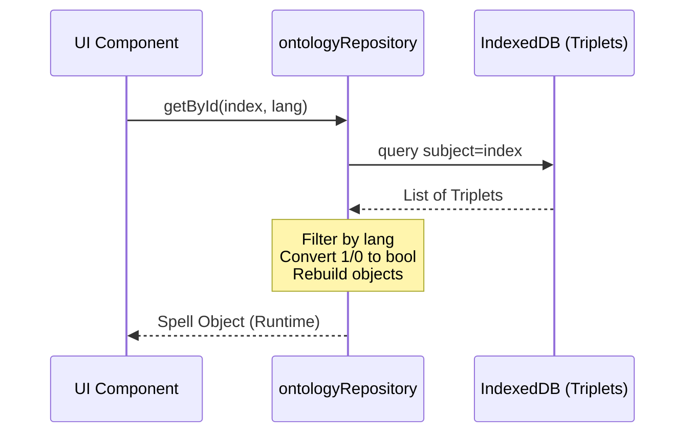

# Spelite Data Architecture

This document describes the data architecture of Spelite, including its semantic ontology, data models, and reactive state management.

## 1. Semantic Ontology (Triplet Store)

Spelite uses a semantic data model inspired by RDF (Resource Description Framework) to store and query game data. Information is stored as **SPO Triplets** (Subject, Predicate, Object) in a local IndexedDB database.

### 1.1. Triplet Structure

Each triplet is defined by the following interface:

```typescript
interface Triplet {
  s: string; // Subject (e.g., "dnd:spell:fireball")
  p: string; // Predicate (e.g., "dnd:level")
  o: any; // Object (e.g., 3)
  lang?: string; // Optional: language for literal values (e.g., "en", "fr")
}
```

### 1.2. Ontology Predicates

Predicates are prefixed with `dnd:` to avoid collisions and represent specific game properties.

| Predicate           | Type      | Description                                                     |
| ------------------- | --------- | --------------------------------------------------------------- |
| `dnd:index`         | `string`  | Unique identifier (slug) of the entity.                         |
| `dnd:name`          | `string`  | Localized name of the entity (requires `lang`).                 |
| `dnd:desc`          | `string`  | Localized description (multi-line, requires `lang`).            |
| `dnd:level`         | `number`  | Spell level (0 to 9).                                           |
| `dnd:school`        | `string`  | Magic school (e.g., "evocation").                               |
| `dnd:ritual`        | `boolean` | Stored as `1` (true) or `0` (false).                            |
| `dnd:concentration` | `boolean` | Stored as `1` (true) or `0` (false).                            |
| `dnd:components`    | `string`  | Casting components (V, S, M). Multiple triplets per subject.    |
| `dnd:classes`       | `string`  | Classes that can cast the spell. Multiple triplets per subject. |
| `dnd:casting_time`  | `string`  | Localized casting time (requires `lang`).                       |
| `dnd:range`         | `string`  | Localized range (requires `lang`).                              |
| `dnd:duration`      | `string`  | Localized duration (requires `lang`).                           |
| `dnd:material`      | `string`  | Localized material components (requires `lang`).                |

#### Spell Mechanics Predicates

| Predicate                  | Type      | Description                                          |
| -------------------------- | --------- | ---------------------------------------------------- |
| `dnd:has_attack_roll`      | `boolean` | Stored as `1` or `0`.                                |
| `dnd:has_save`             | `boolean` | Stored as `1` or `0`.                                |
| `dnd:save_ability`         | `string`  | Ability score for the saving throw (str, dex, etc.). |
| `dnd:damage_type`          | `string`  | Type of damage dealt.                                |
| `dnd:area_of_effect_type`  | `string`  | Type of area (sphere, cone, etc.).                   |
| `dnd:area_of_effect_value` | `number`  | Size of the area.                                    |
| `dnd:area_of_effect_unit`  | `string`  | Unit of measurement (foot, mile).                    |
| `dnd:higher_levels`        | `boolean` | Stored as `1` or `0`. Indicates scaling.             |

### 1.3. Localization and Data Storage

- **Language Handling**: Localized properties (like `name` or `desc`) have one triplet per supported language, distinguished by the `lang` field.
- **Boolean Storage**: To facilitate IndexedDB compound indexing `[p+o]`, booleans are normalized to integers: `true -> 1`, `false -> 0`.
- **Multi-valued Properties**: Properties like `classes` or `components` result in multiple triplets with the same subject and predicate but different objects.

## 2. Core Entity Models

Spelite distinguishes between data storage formats and runtime application models.

### 2.1. Spell Models

There are two primary representations of a spell:

#### RawSpell (Storage Format)

The `RawSpell` interface represents how spells are structured in the source `spells.json` and before being flattened into triplets. It is designed to be JSON-LD compatible.

- **Localization**: Uses `LocalizedString` (e.g., `{ "en": "Fireball", "fr": "Boule de feu" }`).
- **Structure**: Flat properties with nested `mechanics`.

#### Spell (Runtime Format)

The `Spell` interface is the object reconstructed by the `ontologyRepository` for a specific language.

- **Localization**: Properties are strings in the requested language.
- **Structure**: Includes `APIReference` objects for schools and classes to maintain compatibility with standard D&D 5e data structures.

### 2.2. Character Model

The Character model is the heart of the application's reactive state, implemented in `src/models/Character.ts`.

#### CharacterState

The raw data persisted in IndexedDB, containing basic information:

- `stats`: Ability scores (STR, DEX, etc.).
- `hp`: Current, max, and temporary hit points.
- `knownSpells` & `preparedSpells`: Lists of spell indices.

#### Reactive Signals

The `Character` class wraps the state in Preact Signals (`$` property). This allows for granular updates and efficient UI re-renders.

- **Computed Properties**: Many character stats are derived automatically using `computed` signals from `src/utils/rules.ts`:
  - `spellSaveDC`: 8 + proficiency + spellcasting modifier.
  - `proficiencyBonus`: Derived from level.
  - `slots`: Available spell slots based on class and level.

### 2.3. Reference Data (Classes and Races)

While spells are handled via the semantic ontology, Classes and Races currently use simpler JSON structures (`Class` and `Race` interfaces) to provide core game rules like hit dice, spellcasting abilities, and proficiency progression.

## 3. Data Flow and Transformation

Understanding how data moves through Spelite is crucial for maintenance and extensibility.

### 3.1. Ingestion: The Flattening Process

When the application initializes or data is updated, source JSON-LD objects (like `RawSpell`) are transformed into triplets using `src/utils/ontologyFlattener.ts`.



### 3.2. Retrieval: Reconstruction from Triplets

To use data in the UI, it must be reconstructed from the flat triplet store. This is handled by `src/data/ontologyRepository.ts`.



### 3.3. Reactive Integration: Rules Engine

The `Character` model integrates these static entities with dynamic game rules using `src/utils/rules.ts`.

1. **State Update**: When a user changes a character's level or stats, the base signals update.
2. **Computed recalculation**: Dependent signals (like `spellSaveDC`) automatically re-calculate by calling functions in `rules.ts` (e.g., `calculateProficiency(level)`).
3. **Source Linking**: Spells available to a character are filtered by the `getSpellSources` rule, which links the character's class, subclass, and race to specific ontology filters.

## 4. Summary of Data Relationships

```mermaid
erDiagram
    RAW-SPELL ||--o{ TRIPLET : "flattens to"
    TRIPLET }o--|| SPELL : "reconstructs to"
    CHARACTER ||--o{ SPELL : "knows / prepares"
    CHARACTER ||--|| RULES-ENGINE : "queries for stats"
    RULES-ENGINE ||--o{ CLASS-DATA : "uses for slots"
```
